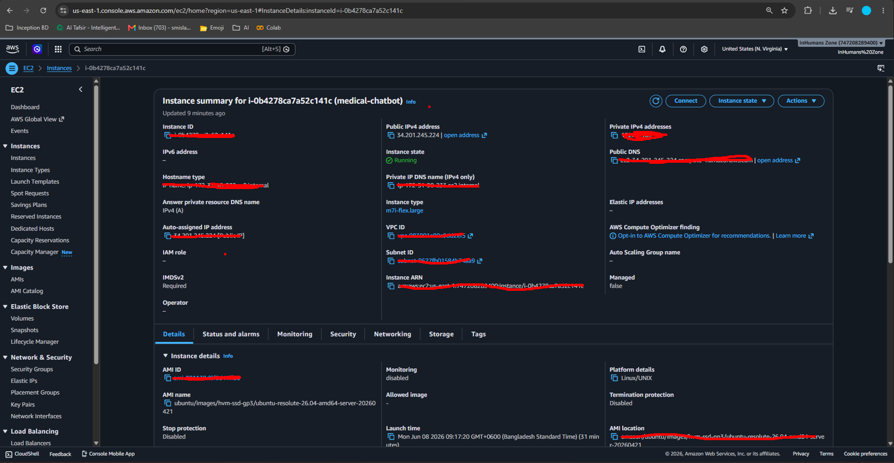
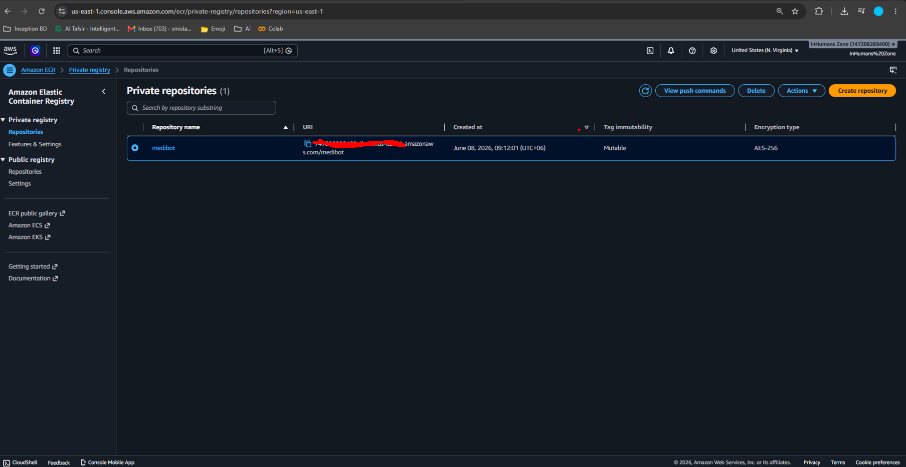
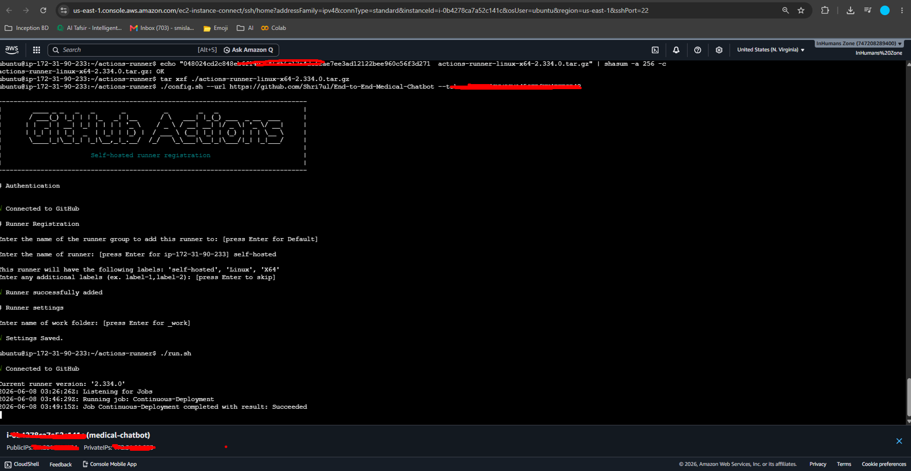
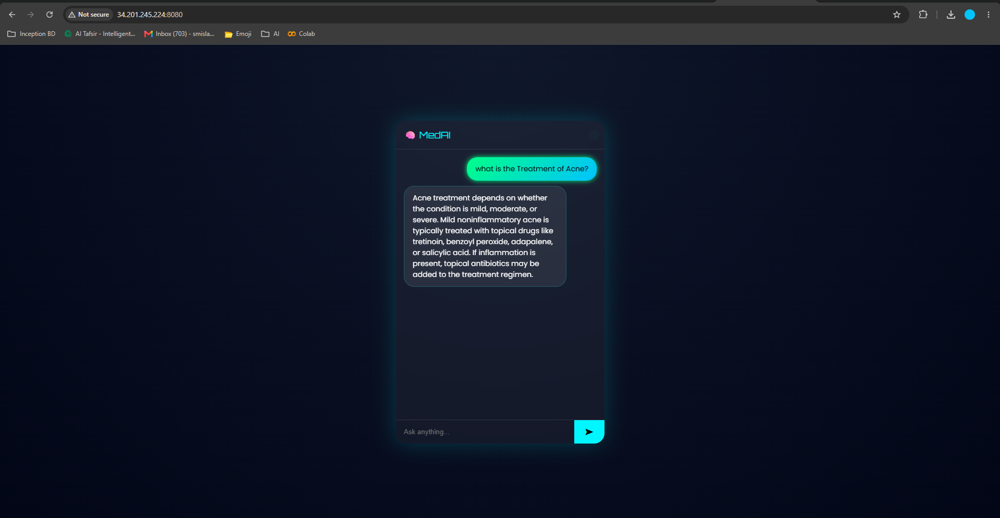

# 🧠 End-to-End Medical Chatbot

An AI-powered medical assistant that uses **RAG (Retrieval-Augmented Generation)** to provide accurate, context-aware responses based on medical knowledge.

Built with a focus on **real-world usability, scalability, and production deployment**.

---

## 🚀 Features

* 💬 AI-powered medical chatbot (context-aware responses)
* 📚 Semantic search using vector embeddings
* 🧠 RAG pipeline with external knowledge retrieval
* ⚡ Fast API responses with optimized backend
* ☁️ Ready for cloud deployment (AWS + Docker + CI/CD)

---

## 🛠 Tech Stack

* Python
* Flask
* LangChain
* OpenAI (LLM)
* Pinecone (Vector DB)
* Docker
* AWS (EC2, ECR)
* GitHub Actions (CI/CD)

---

## 🖼️ Demo Video

[*Click Here*](https://www.linkedin.com/feed/update/urn:li:activity:7452691448363130880/)

---

## ⚙️ How to Run Locally

### 1. Clone Repository

```bash
git clone https://github.com/Shri7ul/End-to-End-Medical-Chatbot.git
cd End-to-End-Medical-Chatbot
```

---

### 2. Create Virtual Environment

```bash
conda create -n medibot python=3.10 -y
conda activate medibot
```

---

### 3. Install Dependencies

```bash
pip install -r requirements.txt
```

---

### 4. Setup Environment Variables

Create a `.env` file in the root directory:

```ini
PINECONE_API_KEY=your_pinecone_api_key
OPENAI_API_KEY=your_openai_api_key
```

---

### 5. Store Embeddings

```bash
python store_index.py
```

---

### 6. Run Application

```bash
python app.py
```

Open in browser:

```
http://localhost:5000
```

---

# AWS-CICD-Deployment-with-Github-Actions

## 1. Login to AWS console.

## 2. Create IAM user for deployment

	#with specific access

	1. EC2 access : It is virtual machine

	2. ECR: Elastic Container registry to save your docker image in aws


	#Description: About the deployment

	1. Build docker image of the source code

	2. Push your docker image to ECR

	3. Launch Your EC2 

	4. Pull Your image from ECR in EC2

	5. Lauch your docker image in EC2

	#Policy:

	1. AmazonEC2ContainerRegistryFullAccess

	2. AmazonEC2FullAccess

	
## 3. Create ECR repo to store/save docker image
    - Save the URI: 315865595366.dkr.ecr.us-east-1.amazonaws.com/medibot

	
## 4. Create EC2 machine (Ubuntu) 

## 5. Open EC2 and Install docker in EC2 Machine:
	
	
	#optinal

	sudo apt-get update -y

	sudo apt-get upgrade
	
	#required

	curl -fsSL https://get.docker.com -o get-docker.sh

	sudo sh get-docker.sh

	sudo usermod -aG docker ubuntu

	newgrp docker
	
# 6. Configure EC2 as self-hosted runner:
    setting>actions>runner>new self hosted runner> choose os> then run command one by one


# 7. Setup github secrets:

   - AWS_ACCESS_KEY_ID
   - AWS_SECRET_ACCESS_KEY
   - AWS_DEFAULT_REGION
   - ECR_REPO
   - PINECONE_API_KEY
   - OPENAI_API_KEY


## Deployment Evidence

### AWS EC2 Instance


### AWS ECR Instance


### GitHub Actions Runner


### Running Application


## 📈 Project Architecture

* Document ingestion → Chunking → Embedding
* Vector storage (Pinecone)
* Query → Semantic retrieval
* Context + LLM → Final response

---

## 🎯 Learning Outcomes

* End-to-end RAG system design
* Vector databases & embeddings
* API + backend structuring
* Production deployment workflow
* CI/CD automation

---

## 👤 Author

**Shriful Islam (InHuman)**

---

## ⭐ Support

If you find this project useful, consider giving it a ⭐ on GitHub.
